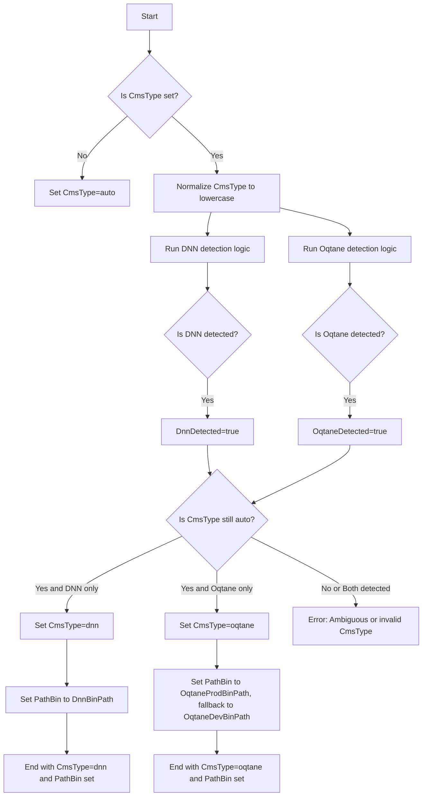
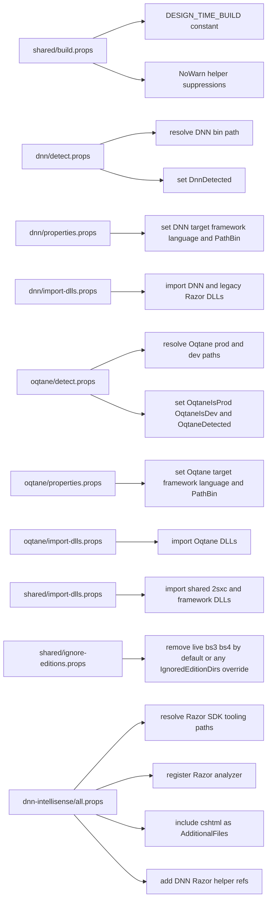

# App Extension: Dotnet Project

This is the app to develop the extension `dotnet-project`.

It exists to make app-level `app.csproj` files much easier to set up for IntelliSense and related editor support in VS Code.

* Check out the extensions docs on <https://go.2sxc.org/ext-csproj>
* Find out more on <https://github.com/2sxc-apps/app-extension-dotnet-project>

## Release Note

This extension was created to restore C# IntelliSense in Razor files in VS Code for legacy DNN `net48` 2sxc apps, after newer C# tooling stopped behaving like the older working version `2.63.52`.

What is included:

- a reusable `app.csproj` helper for 2sxc apps
- automatic platform resolution for DNN and Oqtane
- DNN-specific legacy Razor design-time support
- Oqtane support for both release and source-code layouts
- a validator script to verify that the helper still evaluates and compiles correctly in design-time mode

Supported scenarios:

- DNN 9
- DNN 10
- Oqtane 10 release
- Oqtane 10 source

Recommended minimum:

- 2sxc `21.05.00`

Quick install:

1. [install](https://go.2sxc.org/app-ext-install) the `dotnet-project` App Extension into the target app
2. add this import to the app-root `app.csproj`:

```xml
<Import Project="extensions\dotnet-project\all-in-one.import.csproj" />
```

3. open the app folder in VS Code
4. run:

```powershell
pwsh .\tests\validate-helper.ps1
```

Further reading:

- 2sxc VS Code Guide: <https://docs.2sxc.org/guides/vscode/index.html>
- 2sxc App Extensions Technical Docs: <https://docs.2sxc.org/extensions/app-extensions/technical/index.html>

## Current Build Layout

The helper is now intentionally flat and explicit:

- `app.csproj` imports `extensions/dotnet-project/all-in-one.import.csproj`
- `all-in-one.import.csproj` is the composition root
- the composition root imports only a small number of topic files, then dispatches into the DNN or Oqtane branch based on `CmsType`

Current import order in `all-in-one.import.csproj`:

1. `parts/shared/namespace-and-output-type.props`
2. `parts/shared/build.props`
3. `parts/shared/detect-cms.props`
4. `parts/dnn/properties.props` only when `CmsType=dnn`
5. `parts/dnn/import-dlls.props` only when `CmsType=dnn`
6. `parts/oqtane/properties.props` only when `CmsType=oqtane`
7. `parts/oqtane/import-dlls.props` only when `CmsType=oqtane`
8. `parts/shared/import-dlls.props`
9. `parts/shared/ignore-editions.props`
10. `parts/dnn-intellisense/all.props` only when `DesignTimeBuild=true` and `CmsType=dnn`

## Naming and Structure

The current layout uses 3 kinds of props files:

- `shared/*`
  Common project shape, environment detection and `CmsType` resolution, shared references, and edition filtering
- `dnn/*` and `oqtane/*`
  Platform-specific detection, properties, and references
- `dnn-intellisense/*`
  DNN-only Razor design-time support for VS Code IntelliSense

## Current Responsibilities

- `parts/shared/namespace-and-output-type.props`
  - sets `RootNamespace=AppCode`
  - sets `OutputType=Library`
- `parts/shared/build.props`
  - keeps `DESIGN_TIME_BUILD` defined for the helper project
  - centralizes warning suppressions used by the helper
- `parts/shared/detect-cms.props`
  - defaults `CmsType` to `auto`
  - normalizes `CmsType` to lowercase
  - imports `parts/dnn/detect.props` and `parts/oqtane/detect.props`
  - switches `CmsType` from `auto` to `dnn` or `oqtane` when only one host is detected
  - validates invalid or ambiguous host resolution before build
- `parts/dnn/detect.props`
  - defaults `DnnMainDll` to `DotNetNuke.dll`
  - resolves `DnnBinPath` for both standard and edition-based layouts
  - sets `DnnDetected=true` when the marker DLL exists
- `parts/dnn/properties.props`
  - defaults `DnnTargetFramework=net48`
  - defaults `DnnLangVersion=8.0`
  - applies `TargetFramework`, `LangVersion`, and `PathBin` for the DNN branch
- `parts/dnn/import-dlls.props`
  - adds DNN and classic ASP.NET references
  - adds legacy Razor DLL references for DNN
  - keeps the ASP.NET Core 2.2 package workaround used for editor support
- `parts/oqtane/detect.props`
  - defaults `OqtaneMainDll` to `Oqtane.Server.dll`
  - defaults `OqtaneTargetFramework=net10.0`
  - resolves production and dev/source paths for standard and edition-based layouts
  - sets `OqtaneIsProd`, `OqtaneIsDev`, and `OqtaneDetected`
- `parts/oqtane/properties.props`
  - defaults `OqtaneLangVersion=latest`
  - applies `TargetFramework` and `LangVersion` for Oqtane
  - sets `PathBin` to prod first, then falls back to dev/source
- `parts/oqtane/import-dlls.props`
  - imports `Oqtane.*.dll` from the resolved `PathBin`
- `parts/shared/import-dlls.props`
  - imports shared references such as `ToSic.*`, `Connect.Koi`, `CsvHelper`, `System.Text.Json`, and `System.Memory`
  - imports `Dependencies\*.dll` from the app
- `parts/shared/ignore-editions.props`
  - defaults `IgnoredEditionDirs` to `live;bs3;bs4`
  - normalizes and expands the semicolon-separated list
  - removes ignored items early
  - removes them again before `CoreCompile` because SDK inference can re-add them
- `parts/dnn-intellisense/all.props`
  - aggregates the DNN-only design-time helper files
- `parts/dnn-intellisense/razor-tool-paths.props`
  - resolves the Razor SDK folders from `MSBuildSDKsPath`
- `parts/dnn-intellisense/razor-analyzers.props`
  - resolves `RazorAnalyzerPath`
  - registers the Razor analyzer
- `parts/dnn-intellisense/razor-tooling.props`
  - resolves and adds the helper assemblies needed for legacy DNN Razor IntelliSense
- `parts/dnn-intellisense/include-cshtml.props`
  - includes `**\*.cshtml` as `AdditionalFiles`
  - preserves `TargetPath` for the Razor design-time pipeline
- `tests/validate-helper.ps1`
  - runs the property evaluation check
  - runs the design-time compile check
  - defaults to the local app `app.csproj`
  - accepts `-Project` to validate a different `app.csproj`

## Validation

Use `validate-helper.ps1` after changing any import, host resolution, reference, or design-time file.

The script is a thin wrapper around two `dotnet msbuild` checks:

1. `Property evaluation`
   Verifies that the helper resolves the expected core values:
   `CmsType`, `TargetFramework`, and `PathBin`.
2. `Design-time compile`
   Runs `Compile` with `DesignTimeBuild=true`, `BuildingInsideVisualStudio=true`, and `SkipCompilerExecution=true` to verify the IntelliSense pipeline still evaluates correctly.

Requirements:

- `pwsh`
- `dotnet`

Common usage:

```powershell
# from the app root
pwsh .\tests\validate-helper.ps1

# against a specific helper app
pwsh .\tests\validate-helper.ps1 -Project "A:\path\to\app.csproj"
```

What the script does:

1. Resolves the project path.
2. Prints each `dotnet msbuild` command before running it.
3. Stops immediately if either check fails.
4. Prints `Validation completed successfully.` if both checks pass.

## Diagrams

### 1. Import flow

<!-- Note: on line "direction TB" it should be "direction TD" but there's a bug in Mermaid 11.12 (docfx) which fails
  there is a fix, but we must wait till docfx uses mermaid 11.13+ to update - see
  - https://github.com/mermaid-js/mermaid/releases
  - https://github.com/mermaid-js/mermaid/pull/6989/changes
-->

```mermaid
flowchart TB
 subgraph allInOne["<code>extensions/dotnet-project/all-in-one.import.csproj</code>"]
    direction TB
        prep["prep"]
        cmsDetect["cmsDetect"]
        dnn["dnn"]
        oqtane["oqtane"]
        common["common"]
        dnnDevKit["dnnDevKit"]
  end
 subgraph prep["Step 1: Preparation <code>/1-prep/</code>"]
    direction LR
        prepNs["namespace-and-output-type.props"] -->
        prepBuild["constants-and-warnings.props"]
  end
 subgraph cmsDetect["Step 2: Prepare Paths and Detect CMS <code>/2-detect/</code>"]
    direction LR
        prepCMS["detect-cms.props"]
  end
 subgraph dnn["Step 3: Setup DNN <code>/3-setup/dnn/</code>"]
    direction LR
        dnnDlls["import-dlls.props"]
        dnnProps["properties.props"]
  end
 subgraph oqtane["Step 3: Setup Oqtane <code>/3-setup/oqtane/</code>"]
    direction LR
        oqtDlls["import-dlls.props"]
        oqtProps["properties.props"]
  end
 subgraph common["Step 8: Final Steps <code>/8-final/</code>"]
    direction LR
        commonEditions["ignore-editions.props"]
        commonDlls["import-dlls.props"]
  end
 subgraph dnnDevKit["Step 9: DNN C# DevKit Helpers <code>/9-devkit/dnn/all.props</code>"]
    direction LR
        DTPATHS["razor-tool-paths.props"]
        DTAN["razor-analyzers.props"]
        DTTOOLS["razor-tooling.props"]
        DTCSHTML["include-cshtml.props"]
  end
    dnnProps --> dnnDlls
    oqtProps --> oqtDlls
    commonDlls --> commonEditions
    APP["app.csproj<br>(your file)"] --> allInOne
    prep --> cmsDetect
    cmsDetect -- "CmsType == oqtane" --> oqtane
    cmsDetect -- "CmsType == dnn" --> dnn
    dnn --> common
    oqtane --> common
    common -- "if DesignTimeBuild and CmsType == dnn" --> dnnDevKit
    DTPATHS --> DTAN
    DTAN --> DTTOOLS
    DTTOOLS --> DTCSHTML

    prepCMS@{ shape: subproc}
     dnnDevKit:::noWrap
     allInOne:::noWrap
     prep:::noWrap
     cmsDetect:::noWrap
     dnn:::noWrap
     oqtane:::noWrap
    classDef noWrap white-space:nowrap
```



### 2. Paths and CMS Detection

This is the flow of code:

1. Set `CmsType=auto` if not previously set.
1. Normalize to lowercase - so it should only be `auto`, `dnn`, or `oqtane` at this point.
1. Run the platform-specific detection logic, which looks for the marker DLL in the expected paths for each platform, and sets `DnnDetected` or `OqtaneDetected` accordingly.
1. If `CmsType` is still `auto`, switch it to `dnn` or `oqtane` if only one of them was detected.
1. If `CmsType` is not `dnn` or `oqtane`, throw an error because the host cannot be resolved.

As an output, it will have a final:

1. `CmsType` value of either `dnn` or `oqtane` that can be used for conditional imports and properties later on.
1. `PathBin` value pointing to the correct `bin` folder of the host, which is needed for reference imports later on.



### 3. Platform and tooling branches


