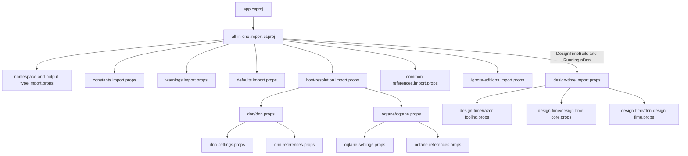
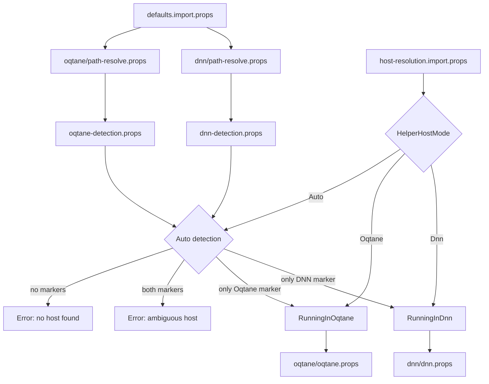
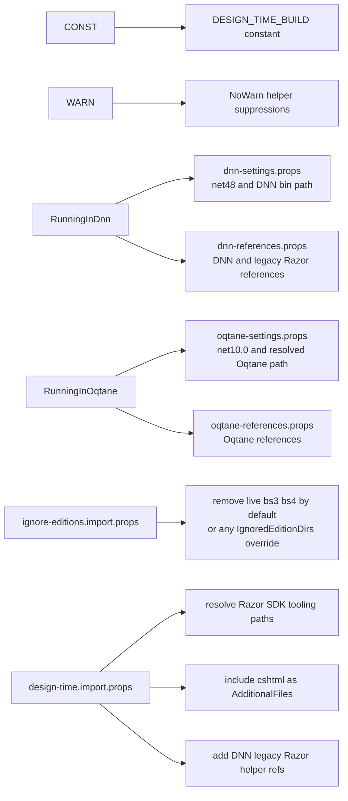

# App Extension: Dotnet Project

This is the app to develop the extension "dotnet-project".

It exists to make app-level `app.csproj` files much easier to set up for IntelliSense and related editor support.

Find out more on <https://github.com/2sxc-apps/app-extension-dotnet-project>

## Current Build Layout

The helper is currently composed from one small root import plus a few focused parts:

- `app.csproj` imports `extensions/dotnet-project/all-in-one.import.csproj`
- `all-in-one.import.csproj` is the composition root and imports:
  - `namespace-and-output-type.import.props`
  - `constants.import.props`
  - `warnings.import.props`
  - `defaults.import.props`
  - `host-resolution.import.props`
  - `common-references.import.props`
  - `ignore-editions.import.props`
  - `design-time.import.props` only when `DesignTimeBuild=true` and `RunningInDnn=true`

## Naming and Structure

The helper now follows a simple convention similar to the shared import setup in `Src/SharedImports`:

- top-level `*.import.props` files are the public composition surface
- nested `*.props` files are implementation details used by one area such as `dnn`, `oqtane`, or `design-time`
- `all-in-one.import.csproj` stays small and readable, with one import per concern and comments that explain the import order

This keeps the root readable while still allowing host-specific and tooling-specific internals to stay separate.

## Current Responsibilities

- `namespace-and-output-type.import.props`
  - sets `RootNamespace=AppCode`
  - sets `OutputType=Library`
- `constants.import.props`
  - adds the stable `DESIGN_TIME_BUILD` constant
- `warnings.import.props`
  - centralizes warning suppressions needed by the helper project
- `defaults.import.props`
  - defines default host mode
  - defines default target frameworks and language versions
  - defines marker file names for DNN and Oqtane detection
  - defines default path candidates for normal and edition-based app layouts
  - provides a fallback `TargetFramework` so validation can run before host resolution completes
- `host-resolution.import.props`
  - imports DNN and Oqtane path resolution first
  - imports DNN and Oqtane detection second
  - normalizes `HelperHostMode`
  - sets `RunningInDnn` or `RunningInOqtane`
  - derives `OqtaneIsProd` and `OqtaneIsDev`
  - validates invalid, ambiguous, and missing host resolution
  - conditionally imports `dnn/dnn.props` or `oqtane/oqtane.props`
- `dnn/path-resolve.props`
  - resolves the first useful DNN bin path from marker hits, existing folders, then defaults
- `dnn/dnn-detection.props`
  - sets `DetectedDnn=true` when the resolved DNN marker file exists
- `dnn/dnn-settings.props`
  - sets `TargetFramework`, `LangVersion`, and `PathBin` for the DNN branch
- `dnn/dnn-references.props`
  - adds DNN-specific assembly references
  - adds classic Razor 3 era DNN references
  - keeps the ASP.NET Core 2.2 Razor package workaround used by the helper
- `oqtane/path-resolve.props`
  - resolves the first useful Oqtane prod and dev paths from marker hits, existing folders, then defaults
- `oqtane/oqtane-detection.props`
  - detects Oqtane prod and dev layouts using `Oqtane.Server.dll`
- `oqtane/oqtane-settings.props`
  - sets `TargetFramework` and `LangVersion` for the Oqtane branch
  - sets `PathBin` to the prod path when prod is detected, otherwise falls back to the dev path
- `oqtane/oqtane-references.props`
  - adds Oqtane-specific assembly references
- `common-references.import.props`
  - adds shared references from `PathBin`
  - adds `Dependencies\*.dll`
- `ignore-editions.import.props`
  - defaults `IgnoredEditionDirs` to `live;bs3;bs4`
  - supports a semicolon-separated list of ignored edition folders
  - removes matching items from `None`, `Content`, `Compile`, and `EmbeddedResource`
  - uses `%3B` instead of literal `;` when overridden on the MSBuild command line
- `design-time.import.props`
  - aggregates legacy DNN Razor design-time support
  - is imported only for DNN design-time builds
- `design-time/razor-tooling.props`
  - resolves Razor analyzer and helper assembly paths from the installed Razor SDK
- `design-time/design-time-core.props`
  - includes `**\*.cshtml` as `AdditionalFiles`
  - wires the Razor analyzer
- `design-time/dnn-design-time.props`
  - adds the helper assembly references needed for legacy DNN Razor IntelliSense
- `scripts/validate-helper.ps1`
  - runs the property evaluation check
  - runs the design-time compile check
  - defaults to the local app `app.csproj`

## Validation

Run the bundled validator from the app root:

```powershell
pwsh .\extensions\dotnet-project\scripts\validate-helper.ps1
```

## Diagrams

### 1. Import flow



### 2. Host resolution and dispatch



### 3. Platform and tooling branches


