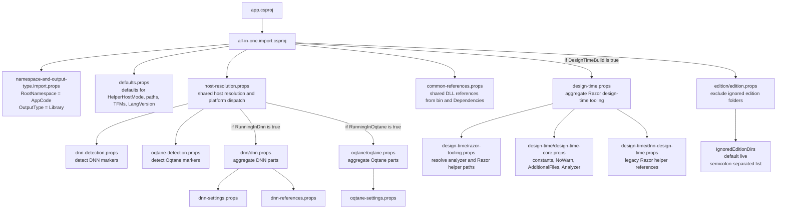
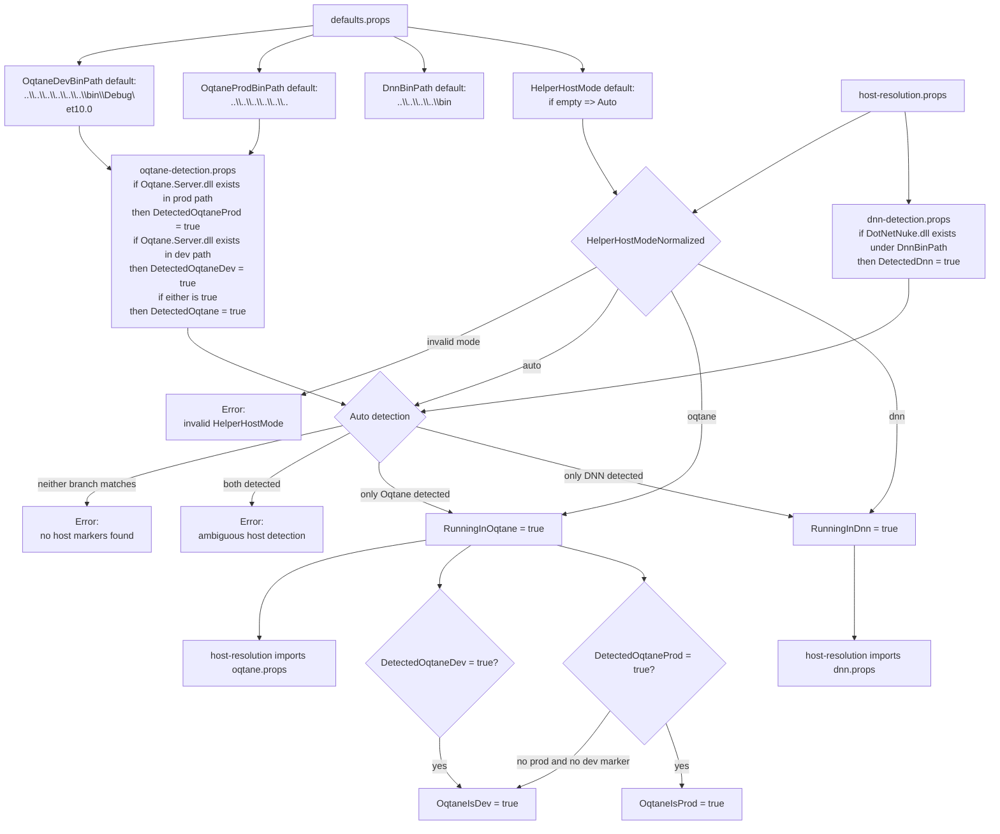
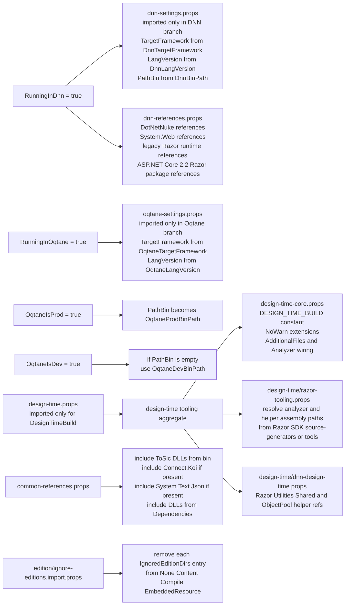

# App Extension: Dotnet Project

This is the app to develop the extension "dotnet-project".

It's meant to make it much easier to setup apps so that they work with IntelliSense and the new .csproj format.

Find out more on <https://github.com/2sxc-apps/app-extension-dotnet-project>

## Current Build Layout

The helper is currently composed from one small root import plus a few focused aggregators:

- `app.csproj` imports `extensions/dotnet-project/all-in-one.import.csproj`
- `all-in-one.import.csproj` is the composition root and imports:
  - `namespace-and-output-type.import.props`
  - `defaults.props`
  - `host-resolution.props`
  - `common-references.props`
  - `design-time.props` only when `DesignTimeBuild=true`
  - `edition/ignore-editions.import.props`
- `host-resolution.props` always imports both detection files, resolves `RunningInDnn` and `RunningInOqtane`, validates `HelperHostMode`, then conditionally imports the DNN or Oqtane branch
- `dnn/dnn.props` is a thin DNN aggregator that imports `dnn-settings.props` and `dnn-references.props`
- `oqtane/oqtane.props` is a thin Oqtane aggregator that imports `oqtane-settings.props`
- `design-time.props` is a design-time-only aggregator for Razor tooling and VS Code IntelliSense support
- `common-references.props` contains shared references that depend on the resolved `PathBin`
- `edition/ignore-editions.import.props` removes edition-specific folders from IntelliSense inputs using `IgnoredEditionDirs`

## Current Responsibilities

- `defaults.props`
  - defines default host mode, bin paths, target frameworks and language versions
  - provides a fallback `TargetFramework` so validation can run before host resolution completes
- `host-resolution.props`
  - imports `dnn/dnn-detection.props` and `oqtane/oqtane-detection.props`
  - normalizes `HelperHostMode`
  - sets `RunningInDnn` or `RunningInOqtane`
  - derives `OqtaneIsProd` and `OqtaneIsDev`
  - fails fast on invalid, ambiguous, or missing host resolution
  - conditionally imports `dnn/dnn.props` or `oqtane/oqtane.props`
- `dnn/dnn-detection.props`
  - sets `DetectedDnn=true` when `DotNetNuke.dll` exists under `DnnBinPath`
- `dnn/dnn-settings.props`
  - sets `TargetFramework`, `LangVersion`, and `PathBin` for the DNN branch
- `dnn/dnn-references.props`
  - adds DNN DLL references
  - adds classic legacy Razor DLL references used in DNN scenarios
  - currently also adds the ASP.NET Core 2.2 Razor package references used by the helper
- `oqtane/oqtane-detection.props`
  - detects Oqtane prod and dev layouts using `Oqtane.Server.dll`
- `oqtane/oqtane-settings.props`
  - sets `TargetFramework` and `LangVersion` for the Oqtane branch
  - sets `PathBin` to the prod path when prod is detected, otherwise falls back to the dev path
- `common-references.props`
  - adds shared references from `PathBin` plus `Dependencies\*.dll`
- `design-time/razor-tooling.props`
  - resolves Razor analyzer and helper assembly paths from the installed Razor SDK
- `design-time/design-time-core.props`
  - adds `DESIGN_TIME_BUILD`
  - extends `NoWarn`
  - includes `**\*.cshtml` as `AdditionalFiles`
  - wires the Razor analyzer
- `design-time/dnn-design-time.props`
  - adds the Razor helper assembly references used for legacy Razor IntelliSense when those assemblies can be resolved
- `edition/ignore-editions.import.props`
  - defaults `IgnoredEditionDirs` to `live;bs3;bs4` for backward compatibility
  - supports multiple ignored folders as a semicolon-separated list
  - removes all matching folders from `None`, `Content`, `Compile`, and `EmbeddedResource`
  - normalizes simple spaces around semicolons before expanding the list
  - when overriding from the MSBuild command line, use `%3B` instead of a literal `;`

## Diagrams

### 1. Import flow

### 2. Host resolution and dispatch

### 3. Platform-specific and design-time branches

