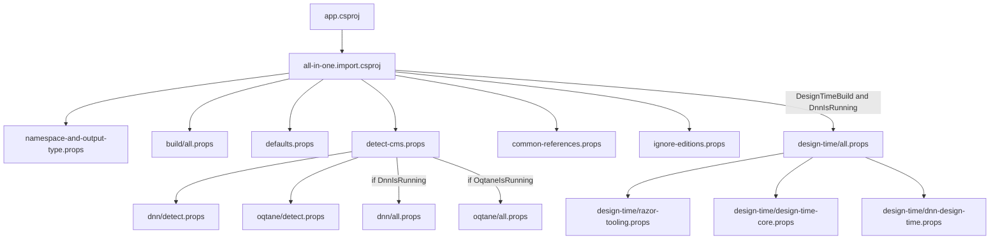
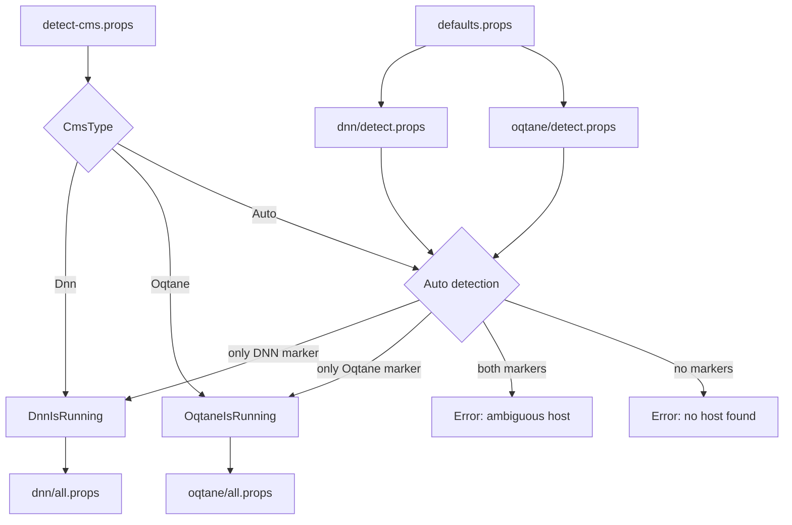
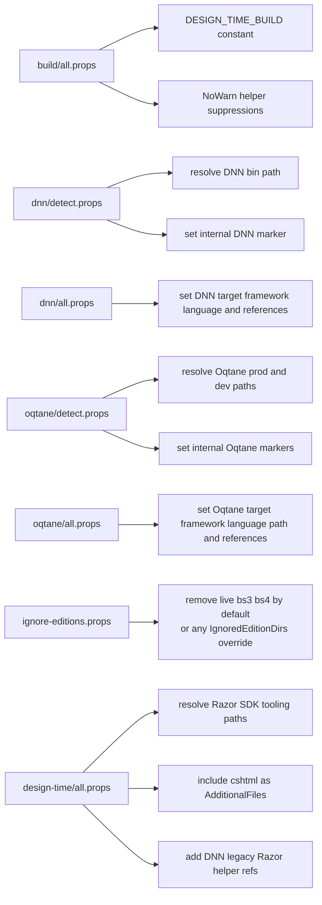

# App Extension: Dotnet Project

This is the app to develop the extension `dotnet-project`.

It exists to make app-level `app.csproj` files much easier to set up for IntelliSense and related editor support in VS Code.

Find out more on <https://github.com/2sxc-apps/app-extension-dotnet-project>

## Release Note

This extension was created to restore C# IntelliSense in Razor files in VS Code for legacy DNN `net472` apps, after newer C# tooling stopped behaving like the older working version `2.63.52`.

What is included:

- a reusable `app.csproj` helper for 2sxc apps
- automatic host resolution for DNN and Oqtane
- DNN-specific legacy Razor design-time support
- Oqtane support for both release and source-code layouts
- a validator script to verify that the helper still evaluates and compiles correctly in design-time mode

Supported scenarios:

- DNN 9
- DNN 10
- Oqtane 10 release
- Oqtane 10 source

Recommended minimum:

- 2sxc `21.05.00`

Quick install:

1. [install](https://go.2sxc.org/app-ext-install) the `dotnet-project` App Extension into the target app
2. add this import to the app-root `app.csproj`:

```xml
<Import Project="extensions\dotnet-project\all-in-one.import.csproj" />
```

3. open the app folder in VS Code
4. run:

```powershell
pwsh .\extensions\dotnet-project\scripts\validate-helper.ps1
```

Further reading:

- 2sxc VS Code Guide: <https://docs.2sxc.org/guides/vscode/index.html>
- 2sxc App Extensions Technical Docs: <https://docs.2sxc.org/extensions/app-extensions/technical/index.html>

## Current Build Layout

The helper is currently composed from one small root import plus a few focused groups:

- `app.csproj` imports `extensions/dotnet-project/all-in-one.import.csproj`
- `all-in-one.import.csproj` is the composition root and imports:
  - `namespace-and-output-type.props`
  - `build/all.props`
  - `defaults.props`
  - `detect-cms.props` (switches between `dnn/all.props` and `oqtane/all.props` based on host detection)
  - `common-references.props`
  - `ignore-editions.props`
  - `design-time/all.props` only when `DesignTimeBuild=true` and `DnnIsRunning=true`

## Naming and Structure

The helper now follows a simpler convention:

- top-level `*.props` files are the public composition surface
- folder-level `all.props` files aggregate one topic such as `build` or `design-time`
- platform folders use:
  - `detect.props` for host marker and path resolution
  - `all.props` for the platform settings and references that apply only after host resolution chose that branch

This keeps the import order explicit.

## Current Responsibilities

- `namespace-and-output-type.props`
  - sets `RootNamespace=AppCode`
  - sets `OutputType=Library`
- `build/all.props`
  - adds the stable `DESIGN_TIME_BUILD` constant
  - centralizes warning suppressions needed by the helper project
- `defaults.props`
  - defines public defaults such as host mode, target frameworks, language versions, and marker file names
  - provides a fallback `TargetFramework` so validation can run before host resolution completes
- `detect-cms.props`
  - imports `dnn/detect.props` and `oqtane/detect.props`
  - normalizes `CmsType`
  - sets `DnnIsRunning` or `OqtaneIsRunning`
  - validates invalid, ambiguous, and missing host resolution
  - conditionally imports `dnn/all.props` or `oqtane/all.props`
- `dnn/detect.props`
  - resolves the DNN bin path for standard and edition-based layouts
  - sets the internal DNN detection marker
- `dnn/all.props`
  - sets `TargetFramework`, `LangVersion`, and `PathBin` for DNN
  - adds DNN-specific assembly references
  - keeps the ASP.NET Core 2.2 Razor package workaround used by the helper
- `oqtane/detect.props`
  - resolves the Oqtane prod and dev paths for standard and edition-based layouts
  - sets the internal Oqtane detection markers
- `oqtane/all.props`
  - chooses prod vs dev path after host resolution selected Oqtane
  - sets `TargetFramework`, `LangVersion`, and `PathBin` for Oqtane
  - adds Oqtane-specific assembly references
- `common-references.props`
  - adds shared references from `PathBin`
  - adds `Dependencies\*.dll`
- `ignore-editions.props`
  - defaults `IgnoredEditionDirs` to `live;bs3;bs4`
  - supports a semicolon-separated list of ignored edition folders
  - removes matching items from `None`, `Content`, `Compile`, and `EmbeddedResource`
  - repeats the removal before compile because SDK/default item inference can re-add files later
- `design-time/all.props`
  - aggregates the DNN-only Razor design-time support files
- `design-time/razor-tooling.props`
  - resolves the Razor analyzer and helper assembly paths from the installed Razor SDK
- `design-time/design-time-core.props`
  - includes `**\*.cshtml` as `AdditionalFiles`
  - wires the Razor analyzer
- `design-time/dnn-design-time.props`
  - adds the helper assembly references needed for legacy DNN Razor IntelliSense
- `scripts/validate-helper.ps1`
  - runs the property evaluation check
  - runs the design-time compile check
  - defaults to the local app `app.csproj`
  - accepts `-Project` to validate a different `app.csproj`

## Validation

Use `validate-helper.ps1` after changing any import, host resolution, reference, or design-time file.

The script is a thin wrapper around two `dotnet msbuild` checks:

1. `Property evaluation`
   Verifies that the helper resolves the expected core values:
   `DnnIsRunning`, `OqtaneIsRunning`, `TargetFramework`, and `PathBin`.
2. `Design-time compile`
   Runs `Compile` with `DesignTimeBuild=true`, `BuildingInsideVisualStudio=true`, and `SkipCompilerExecution=true` to verify the IntelliSense pipeline still evaluates correctly.

Requirements:

- `pwsh`
- `dotnet`

Common usage:

```powershell
# from the app root
pwsh .\tests\validate-helper.ps1

# from anywhere, against a specific helper app
pwsh .\tests\validate-helper.ps1 -Project "A:\path\to\app.csproj"
```

What the script does:

1. Resolves the project path.
2. Prints each `dotnet msbuild` command before running it.
3. Stops immediately if either check fails.
4. Prints `Validation completed successfully.` if both checks pass.

## Diagrams

### 1. Import flow



### 2. Host resolution and dispatch



### 3. Platform and tooling branches


